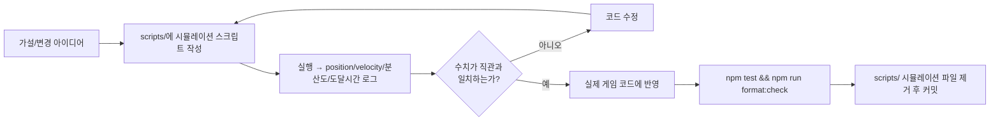

# 개발 규칙

이 문서는 Ball Fight Simulator를 Git으로 관리하면서 계속 업데이트할 기준 문서입니다. 새 규칙이 생기면 이 파일을 먼저 갱신하고, 필요한 경우 `README.md`나 관련 설계 문서에 요약을 반영합니다.

## 시뮬레이션 기반 구현체 검증

변경 전 **항상 시뮬레이션 스크립트를 먼저 실행**하여 구현체의 실제 동작을 수치로 확인한 후에 코드를 수정합니다.



### 원칙

1. **시뮬레이션을 먼저 작성합니다.** 추측으로 코드를 수정하지 말고, `scripts/` 아래에 `BattleSimulation`을 직접 생성하는 `.mjs` 파일을 만듭니다. `JSDOM`이 필요 없으며 순수 Node.js로 실행됩니다.
2. **핵심 지표를 로그로 출력합니다.** 위치, 속도, 분산도(spread), 적 도달 시간, 그룹 유지 여부 등 정량적 수치를 최소 10개 시점에 걸쳐 기록합니다.
3. **직관과 수치가 다르면 수치를 믿고 코드를 수정합니다.** 사람의 예측은 복잡한 동적 시스템에서 자주 빗나갑니다. 시뮬레이션 데이터가 가설과 다르다면 가설이 아니라 구현이 틀린 것입니다.
4. **수정 후 재시뮬레이션으로 개선을 검증합니다.** 같은 스크립트를 다시 실행하여 지표가 의도한 방향으로 변했는지 확인합니다.
5. **시뮬레이션 파일은 커밋하지 않습니다.** `scripts/batSim.mjs` 같은 임시 검증 파일은 커밋 전에 제거합니다.

### 적용 예 — 보이드(Boids) 알고리즘 디버깅

Boids 알고리즘이 눈에 보이지 않는다는 피드백을 받았을 때:
1. `scripts/batSim.mjs`를 작성하여 박쥐 5마리의 위치·속도·분산도를 250ms 간격으로 로깅
2. **분산도 23→227px (흩어짐)**, 보이드 힘 0.2 px/s²가 속도 360 px/s의 0.06%임을 발견
3. 원인: `COHESION_WEIGHT`가 `* 60 * delta`와 곱해져 실질 가속도 0.2 px/s²에 불과
4. 수정: 가속도를 5~30 px/s²로 15~50x 강화, 초기 속도 100 px/s로 1/3 감소
5. 재시뮬레이션: 분산도 22→25→14px (뭉침), 5마리 동시 도달 확인

## 기본 원칙

- 프로젝트 문서, 이슈 정리, 작업 메모의 기본 언어는 한국어입니다.
- 코드 식별자는 기존 JavaScript 스타일을 따르고, 사용자에게 보이는 문구는 한국어를 우선합니다.
- **UI 명칭과 코드 식별자는 항상 정합해야 합니다.** 사용자에게 `숙련도`로 표시하는 개념은 코드에서도 `mastery`를 사용하고, `link` 같은 다른 용어를 섞지 않습니다. 명칭 변경이 있으면 UI 문자열, 코드 식별자(변수/함수/파일명), CSS 클래스, 프로필 키, 문서를 모두 함께 변경합니다.
- 변경은 작고 되돌리기 쉽게 유지합니다.
- **수정 시에는 해당 변경이 의도한 경로뿐 아니라 다른 실행 경로(stat 변경, 상태 전환, 초기화 등)에 미치는 사이드 이펙트를 반드시 검증합니다.** `setStartButton`처럼 여러 호출자가 있는 함수의 동작을 바꿀 때는 모든 호출 지점을 추적해야 합니다.
- 기존 동작을 바꾸는 수정은 가능하면 회귀 테스트를 먼저 추가하거나 기존 테스트를 갱신합니다.
- 새 의존성은 명시적으로 필요할 때만 추가합니다.
- 번들 파일을 생성해서 커밋하지 않습니다. 현재 배포 구조는 `index.html`이 `./src/main.js`를 직접 로드합니다.
- **main에 푸시 또는 머지하기 전에 반드시 `src/patchNotes.js`의 `PATCH_NOTES`에 패치노트를 먼저 작성합니다.** 패치노트 작성 규칙은 `docs/patch-notes-guide.md`를 참고하세요.
- **패치노트 작성 시 관련 문서도 함께 업데이트합니다.** `docs/game-rules.md`, `src/helpContent.js` 등이 최신 구현과 일치하는지 확인하고, 빠진 내용이 있으면 먼저 보강한 후 패치노트를 작성합니다.
- **`float`는 사용하지 않습니다.** 레이아웃은 `flex` 또는 `grid`로만 처리합니다.

## 팀 기반 전투 확장 규칙

전투 시스템은 **1대1**, **1대n**, **n대n**, **개인전(FFA)**을 모두 수용할 수 있는 구조로 작성합니다.

- **모든 fighter는 `teamId`를 기준으로 적/아군을 구분합니다.**
    - `BattleSimulation`은 명시적 `teamId`가 없으면 `fighter-0`, `fighter-1`처럼 서로 다른 기본 팀을 부여해 기존 토너먼트와 개인전 동작을 유지합니다.
    - 같은 `teamId`의 fighter끼리는 충돌 밀어내기 같은 물리는 유지할 수 있지만, 피해와 적대 효과를 주면 안 됩니다.
- **코드는 현재 1대1 구조에 의존하지 않도록 작성합니다.**
    - 각 Ball(엔티티)은 자신의 상태와 로직을 기준으로 동작해야 하며, 항상 `fighters[0]`/`fighters[1]` 같은 고정 인덱스를 참조하지 않습니다.
    - 적대 여부가 필요한 경우 `simulation.isHostile(a, b)`를 사용합니다.
    - 적 목록이 필요한 경우 `simulation.getEnemiesOf(this)`, 단일 대상이 필요한 경우 `simulation.getNearestEnemy(this)` 또는 1v1 호환 별칭인 `simulation.getOpponent(this)`를 사용합니다.
    - Ability 코드에서 특정 상대를 대상으로 하드코딩하지 않고, `update(delta, target)`으로 전달된 target 또는 simulation을 통해 대상을 찾습니다.
- **컬렉션 순회는 `filter`, `map`, `forEach`, `for...of`를 사용**하고 인덱스 기반 루프를 피합니다.
- 새 능력/시스템을 추가할 때도 1대1 전제 없이 다수의 Ball이 공존할 수 있는 구조로 설계합니다.

## 코드 스타일

### 네이밍 규칙

| 대상 | 규칙 | 예시 |
|---|---|---|
| **파일명** | `camelCase` | `archerAbility.js`, `battleBall.js`, `clickActions.js` |
| **디렉토리명** | `kebab-case` | `character-mastery/`, `click-actions/` |
| **클래스** | `PascalCase` | `class BattleBall`, `class ArcherAbility` |
| **함수/변수** | `camelCase` | `collectActiveEffects()`, `const masteryLevel` |
| **상수(모듈 레벨)** | `UPPER_SNAKE_CASE` | `export const MAX_POINTS_PER_STAT = 50` |
| **CSS 클래스** | `kebab-case` (접두사: `ch-`) | `.ch-mast-card`, `.ch-ach-badge--gold` |

### 파일 구조

- **한 파일 = 한 개념.** 클래스 하나면 파일 하나. 여러 관련 함수를 모아 내보낼 때는 `index.js` barrel로.
- **폴더링 기준:** 200줄 이상이거나 자연스러운 분리점(예: Ability 클래스들)이 있으면 폴더로 분리.
- **`index.js`**는 폴더 내부의 exports를 모아서 외부에 공개하는 barrel 파일로만 사용. 자체 로직 금지.
- **디렉토리명은 `kebab-case`**, 파일명은 `camelCase` (예외: `index.js`).

### 계층 구조 (Namespace)

**목적**: 디버그 변수, 설정, 실험용 변수는 네임스페이스 객체로 그룹화합니다.

```js
this.debug = {
    startCharacter: null,
    aiEnabled: false
};
```

적용 위치: `assignActions: this.debugAIEnabled || this._currentChallengeLevel > 0`

### 믹스인 vs 상속 (Mixin Pattern)

**핵심 개념**:

| | 의미 | 사용 시기 |
|---|---|---|
| **믹스인** | 이 클래스가 **어떤 기능을 할 수 있는가** (capability) | 선택적 능력 조합, 여러 클래스가 공통 능력을 "골라 담을" 때 |
| **상속** | 이 클래스의 **본질이 무엇인가** (identity) | 실제 공통된 기반을 가질 때, 부모의 모든 속성/메서드가 필요할 때 |

```
❌ 상속으로 능력을 추가하면 → 불필요한 메서드가 따라옴
✅ 믹스인으로 능력을 추가하면 → 필요한 것만 골라 담음
```

**프로젝트 믹스인 구성** (`src/physics/`):

| 믹스인 | 제공 능력 | 사용 클래스 |
|---|---|---|
| `PhysicsBody` | 움직일 수 있다 (pos, velocity, mass, radius, integrate, applyImpulse) | BattleBall, 모든 CombatEntity |
| `LifeSpan` | 시간이 지나면 사라진다 (life, tickLife, lifeProgress) | 모든 이펙트, 모든 투사체 |
| `Cooldown` | 쿨다운이 있다 (tickCooldown, cooldownReady) | 모든 Ability, AIActionController |
| `ProjectileBehavior` | 발사체다 (owner, updateProjectile, hit 판정) | Arrow/Bat/Bullet/Orbit/Grenade/Seed |
| `BurstSequencer` | 연발 발사한다 (startBurst, tickBurst) | 필요 시 선택 적용 |
| `RotationalBody` | 회전한다 (angle, angularVelocity, applyAngularImpulse, integrateRotation) | BattleBall (전체), 회전 가능한 지형/캐릭터/투사체 확장용 |
| `CollisionShape` (helper) | polygon world points 변환, SAT 기반 circle-polygon/polygon-polygon 충돌, fighter shape collision resolver | terrain collision, fighter-vs-fighter 충돌 |
| `PhysicsDebugRingBuffer` (helper) | 고정 길이 ring buffer로 물리 이벤트 기록. NaN/Infinity 감지 시 buffer dump 출력 | 디버깅/트러블슈팅 |

**물리 디버깅 원칙**:
- 과도한 `Number.isFinite` guard를 코드 곳곳에 흩뿌리지 않고, ring buffer 기반 원인 추적을 우선한다.
- 이벤트 snapshot은 항상 값 복사로 저장한다 (Vector2 참조를 그대로 보관하지 않는다).
- 기록 실패가 게임 로직을 깨지 않아야 한다.

**클래스 본질 (상속)**:

| 클래스 | 본질 | 구성 |
|---|---|---|
| `CombatEntity` | 전장에 존재한다 | `PhysicsBody + LifeSpan + isExpired` |
| `Projectile` | 투사체다 | `CombatEntity의 모든 것 + ProjectileBehavior` |
| `BattleBall` | 전사다 | `PhysicsBody + RotationalBody` (기본 회전, `rotationEnabled: false`로 비활성 가능) |
| `Ability` | 능력이다 | `Cooldown` |

**적용 원칙**:

1. **상속은 "is-a" 관계일 때만 사용합니다.** `Projectile is a CombatEntity` → 상속 OK. `GravityParticle is a Projectile` → 아님! 투사체 판정 로직이 불필요하게 따라옴.
2. **능력(capability)은 믹스인으로 제공합니다.** `움직일 수 있다`, `시간 제한이 있다`, `쿨다운이 있다`는 능력이지 본질이 아닙니다.
3. **`mixins()` 합성으로 필요한 능력만 조합합니다.** `mixins([PhysicsBody, LifeSpan, ProjectileBehavior])` — 세 능력을 가진 클래스가 됩니다.
4. **믹스인은 `(Base) => class extends Base` 함수 형태로 작성합니다.** RTS 레포(`C:\projects\rts`) 패턴을 따릅니다.

### 기능 단위 코드 분리 (함수/모듈화)

**항상 기능 단위로 코드를 쪼개서 함수 및 모듈화합니다.**

- 하나의 함수가 여러 책임을 가지지 않도록 합니다.
- `draw(ctx)` 같은 메서드가 모든 그리기 로직을 한 번에 처리하지 않고, 각 하위 기능을 private 메서드(`_drawBat`, `_drawSlashEffect` 등)로 분리합니다.
- `update(delta, target)`도 능력 발동 조건 체크, 쿨타임 관리, 애니메이션 타이머 갱신을 별도 책임으로 분리합니다.
- 분리 기준은 **"하나의 함수는 하나의 일만 한다"** 입니다.

**적용 예 — BatBallAbility.js의 `draw()` 구조:**

```js
draw(ctx) {
    // ── 스윙 아크 ──
    this._drawSlashEffect(ctx);

    // ── 시야 범위 ──
    this._drawVisionArc(ctx);

    // ── 방망이 ──
    this._drawBat(ctx, time);
}

/** 방망이를 항상 들고 있는 모습 */
_drawBat(ctx, time) { ... }

/** 스윙 아크 애니메이션 */
_drawSlashEffect(ctx) { ... }

/** 120도 시야 범위 표시 */
_drawVisionArc(ctx) { ... }
```

- 메서드 분리뿐 아니라 Ability 클래스 자체도 하나의 파일(BatBallAbility.js)로 모듈화되어 있습니다.
- 새 기능을 추가할 때도 같은 원칙을 적용합니다. 예를 들어 `update()` 내에서 시야 스윕, 적 탐지, 쿨타임 관리를 각각의 책임으로 분리하여 가독성과 유지보수성을 높입니다.

### 로직 소유권 원칙

**각 로직은 그 로직을 실행하는 액션 클래스가 직접 소유합니다.**
도메인 객체(Simulation, Entity)는 로직 수행에 필요한 **데이터 접근 인터페이스**만 제공합니다.

```
잘못된 예 #1: ClickAction이 sim.timeSlowRemaining을 직접 수정 (캡슐화 위반)
잘못된 예 #2: ClickAction이 sim.applyTimeWarp()를 호출 (로직을 domain에 위임)
올바른 예:    ClickAction이 sim.getTimeSlow() / sim.setTimeSlow()로 데이터를 읽고,
              Action 내에서 알고리즘(Math.max 등)을 직접 수행
```

#### 적용 예 — 클릭 액션 시스템

```js
// ✅ Action이 로직의 주체
class TimeWarpAction extends ClickAction {
    apply(sim, playerBall) {
        // sim.getTimeSlowRemaining() — domain이 제공하는 인터페이스
        // Action이 Math.max 로직을 직접 수행
        const current = sim.getTimeSlowRemaining();
        sim.setTimeSlowRemaining(Math.max(current, 0.5));
    }
}

class RushAction extends ClickAction {
    apply(sim, playerBall) {
        const current = playerBall.actionContext.getEffect(this.id)?.remaining ?? 0;
        // Action이 지속시간 연장 로직을 직접 수행
        playerBall.actionContext.setEffect(this.id, {
            remaining: current > 0 ? current + 0.5 : 0.5,
            getSpeedMultiplier: () => 1.25
        });
    }
}

// Domain 객체는 Action이 필요로 하는 데이터 접근 함수를 제공
class BattleSimulation {
    getTimeSlowRemaining() {
        return this._timeSlowRemaining;
    }
    setTimeSlowRemaining(v) {
        this._timeSlowRemaining = v;
    }
}

class ActionContext {
    getEffect(id) {
        return this._effects.get(id) ?? null;
    }
    setEffect(id, effect) {
        this._effects.set(id, effect);
    }
}
```

| 액션      | Action이 소유한 로직                                   | Domain이 제공하는 인터페이스                                   |
| --------- | ------------------------------------------------------ | -------------------------------------------------------------- |
| 시간 왜곡 | `max(현재값, duration)` 후 저장                        | `sim.get/ setTimeSlowRemaining()`                              |
| 돌진      | 지속시간 연장 또는 신규 설정 + 속도 배율 적용 + 즉시 돌진 impulse | `ball.actionContext.getEffect(id)`, `ball.actionContext.setEffect(id, effect)`, `ball.applyImpulse()` |
| 카운터    | timed effect 등록 (0.20s, onFighterCollision), incoming damage 반사 | `ball.actionContext.setEffect(id, effect)`                     |
| 투사체 방어 | timed effect 등록 (0.3s, onProjectileDamage)            | `ball.actionContext.setEffect(id, effect)`                     |
| 버티기    | 경감 effect 등록                                       | `ball.actionContext.setEffect(id, effect)`                     |

#### 적용 예 — 런타임 effect / 게임 오브젝트

상태성 게임 오브젝트도 같은 원칙을 따릅니다. 예를 들어 벽 충돌 추가 피해는 `BattleBall`이나 `Simulation`이 직접 계산하지 않고, `WallSlamEffect`가 피해량, 반복 피해 쿨다운, 회전 연출을 소유합니다.

```js
class WallSlamEffect {
    onWallBounce(ball, normal, simulation) {
        if (this.cooldown > 0) return;
        this.cooldown = 0.18;
        ball.takeDamage(this.damage, this.source, "Wall Slam");
        simulation.spawnWallImpact(ball.position.clone(), normal, this.source.color);
    }

    tick(ball, delta) {
        this.cooldown = Math.max(0, this.cooldown - delta);
        this.updateSpin(ball, delta);
    }
}
```

- Ability는 `new WallSlamEffect(...)`처럼 effect를 생성하고 필요한 값만 전달합니다.
- `Simulation`은 벽 충돌 이벤트를 effect에 전달합니다.
- `BattleBall`은 effect의 `tick()`을 호출하고, effect 내부 계산을 직접 소유하지 않습니다.

### polygon-polygon 접촉점 계산

polygon-polygon 충돌의 접촉점(`contactPoint`)은 SAT 기반 접촉 후보 수집으로 계산합니다:
1. **A의 world vertex 중 B 내부/경계에 있는 점**
2. **B의 world vertex 중 A 내부/경계에 있는 점**
3. **edge-edge segment 교차점**

위 후보들의 평균을 contactPoint로 사용하고, 후보가 없을 때만 center midpoint로 fallback합니다.
circle-polygon은 `_closestPoint`(최근접 polygon vertex)를 우선하고, 없을 때 circle surface point를 사용합니다.

### 충돌 물리 / 이동 속도 소유권

전투 볼의 `velocity`는 **충돌 impulse와 기본 이동 목표가 섞인 실제 속도**입니다. 특정 능력이나 액션이 매 틱 `velocity`를 직접 덮어써서 충돌 결과를 지우면, 볼이 겹친 상태에서 매 프레임 충돌 피해가 반복되는 문제가 생깁니다.

```
BattleSimulation:          볼-볼 충돌 감지, 겹침 해소, impulse 계산, applyImpulse() 호출
BattleBall:                현재 velocity를 보존하고 목표 주행 속도로 impulse 보정
Ability / Action / Effect: 목표 방향, 목표 속도, movementEffect, forceHeading 제공
```

- 볼끼리 충돌한 뒤 튕겨 나가는 힘은 `BattleSimulation._applyCollisionPhysics()`가 소유합니다.
- 충돌 회전 impulse는 `BattleSimulation._applyAngularCollisionResponse()`가 소유하며, 충돌 전 접근 속도(`preCollisionVelAlongNormal`) 기준으로 계산합니다. 선형 impulse 적용 후의 velocity로 재계산하지 않습니다.
- `applyAngularImpulse(value)`는 각운동량 L(angular impulse)을 `_accumulatedAngularImpulse`에 누적합니다. `integrateRotation(delta)`에서 `Δω = L * I⁻¹`로 angularVelocity에 반영되며, I⁻¹는 `0.5 * mass * radius²`의 solid disk 관성 모멘트 역수입니다. 같은 angular impulse라도 mass/radius가 큰 객체는 angularVelocity 변화가 작습니다.
- `BattleBall.update()`는 `velocity`를 즉시 목표 속도로 교체하지 않고, `_computeDesiredVelocity()` 결과와 현재 속도의 차이를 `applyImpulse()`로 보정합니다.
- `forceHeading()`은 방향 고정만 소유하고, 고정 속도(`overrideVelocity`)를 소유하지 않습니다.
- `applyKnockback()`은 넉백 impulse를 즉시 더하고, duration 동안 방향만 고정합니다.
- 새 능력에서 순간 이동/대시/넉백이 필요하면 `setMovementEffect()`, `forceHeading()`, `applyKnockback()`, `applyImpulse()` 같은 기존 인터페이스를 사용합니다.
- 충돌 impulse를 추가해야 하는 경우 `BattleBall.applyImpulse()`를 사용하고, ability가 직접 탄성 충돌 공식을 복사하지 않습니다.
- 전투 중 `BattleBall.velocity = ...`, `ball.velocity.x = ...`처럼 속도 필드를 직접 수정하지 않습니다.
- 예외적으로 삼킴, 프리뷰 정지처럼 이동 자체를 멈춰야 하는 상태도 `velocity`를 직접 초기화하지 않고, 현재 속도의 반대 impulse를 넣어 정지시킵니다.
- 생성자에서 초기 `velocity` 필드를 만드는 것은 예외입니다. 아직 물리 상태가 존재하지 않는 객체의 초기 상태 정의이기 때문입니다.

### TricksterAbility / Seed 로직 소유권

```
TricksterAbility:          쿨타임 관리, seed 발사 속도 계산(computeOwnerCombatSpeed × 1.2~1.5),
                           seed 수명 계산(cooldown × 2), seed 생성
SeedOrb (entities.js):     이동, 충돌 대상 판정, 충돌 시 대시 발동 (기존 유지)
```

- Trickster seed 속도 계산식은 Hero Orb의 `computeOwnerCombatSpeed()`를 재사용합니다.
- Hero Orb와 동일하게 `movementSpeed ?? baseSpeed × speedModifier × slowMult × boostMult` 기준입니다.
- seed 수명은 effective cooldown(`this.cooldown`, skill 스탯 반영)의 2배입니다.
- seed 개수(`SEED_COUNT = 3`)와 충돌/대시 로직은 변경되지 않습니다.

### HeroAbility / HeroOrb 로직 소유권

```
HeroAbility:               쿨타임(HERO_ORB_BASE_COOLDOWN=1.0) 관리,
                           cooldown_burst 상태 소유 (_cooldownBurstTimer/_cooldownBurstMultiplier),
                           특수 orb 확률 선택 (pickHeroOrbEffectType),
                           발사 속도 계산(computeOwnerCombatSpeed, owner 속도 × 1.2~1.5),
                           Hero Orb 생성, owner별 orb 제한(10개) 관리
HeroOrb entity:            이동, 충돌 대상 판정, owner/상대 구분,
                           apply() 반환값 기반 획득 텍스트 피드백(spawnActionText)
rollHeroOrbStatGain():     스탯 orb amount 1~3 랜덤 roll (rng 제어 가능)
clampStatGain():           cap clamp — bonus+roll이 cap을 넘지 않도록 실제 amount 조정
HERO_ORB_EFFECTS:          effect type별 적용 로직 + label(표시명) + apply() 반환값
                           ({ applied, amount } — cap에서 실패 시 applied=false)
                           각 스탯 orb는 rollHeroOrbStatGain() + clampStatGain() 사용
formatHeroStatLine():      시작 전 statAllocation과 heroOrbBonuses를 한 줄에 합친 UI 문자열 포맷
formatHeroStatParts():     `+10%(+3)` 중 `(+3)`만 스탯 색상으로 칠하기 위한 UI 조각 포맷
UIController / Alpine.js:  Hero Ball만 fighter card의 statLine을 "기본 배분 + 오브 보너스" 형태로 표시
BattleSimulation:          HeroOrb를 entities 목록에 추가/제거 (spawnHeroOrb)
BattleBall:                heroOrbBonuses 누적값 보유, 직접적인 Hero Ball 전용 if문 없음
```

- 특수 Hero Orb (dash/arrow/cooldown_burst)는 HERO_ORB_EFFECTS에 등록, 기존 로직 재사용:
  - dash: `DashEffect` + `BattleBall.setMovementEffect()` + `forceHeading()` (Dash Ball 전용 로직 복사 금지)
  - arrow: `Simulation.spawnArrow()` + `ArrowProjectile` (owner damage 비례, Archer 회피/쿨타임 복사 금지)
  - cooldown_burst: `HeroAbility.applyCooldownBurst()` → HeroAbility가 multiplier 상태 소유
- Hero Ball 승리 시 carryover: `entities.js`의 `mergeHeroOrbCarryover(spec, gained)`가 소유. `app.js`의 `finishMatch()`는 `winnerSpec.ability === "hero"` 조건으로 호출만 한다.
- carryover 적용: `entities.js`의 `applyHeroOrbCarryoverToBattleBall(ball, carryover)`가 소유. `app.js`의 `startMatch()`는 호출만 한다.
- `computeHeroOrbCarryover(gained, rate)`: 순수 계산 함수. `rate` 기본값 `HERO_ORB_CARRYOVER_RATE = 0.5`.
- `applyHeroOrbStatAmount()`: 랜덤 roll 없이 스탯 1점당 효과만 적용. carryover 전용.
- UI 표시: `mergeOrbBonuses(heroOrbBonuses, heroOrbCarryover)`로 합산.
- `app.js`는 Hero 전용 스탯별 계산(Math.floor, hp/damage/speed/defense/skill 반영)을 직접 하지 않는다.
- 특수 orb 확률: `pickHeroOrbEffectType(rng)` 함수. 기본값 dash=0.10, arrow=0.10, cooldown_burst=0.05. 특수 미선택 시 기존 5종 스탯 orb 중 랜덤.
- 특수 orb는 `heroOrbBonuses` 누적치에 포함되지 않음. `formatHeroStatParts`에서 제외.
- cooldown_burst 중첩 시 duration은 max 연장, multiplier는 0.1 고정.
- 다른 캐릭터와 달리 Hero Ball 고유 로직은 `HeroAbility`, `HeroOrb`, `HERO_ORB_EFFECTS`에 완전히 캡슐화됩니다.
- `BattleSimulation`이나 `BattleBall`에 Hero Ball 전용 조건문이 추가되지 않도록 합니다.
- 새 effect type을 추가하려면 `HERO_ORB_EFFECTS`에 `{ color, label, apply(owner, context) }`만 등록하면 됩니다.
- `apply()`는 반드시 `{ applied: boolean, amount: number }`를 반환해야 합니다.
- `HERO_ORB_STAT_CAP = -1` (기본값, 무한 성장). 0 이상이면 해당 스탯 보너스 상한 도달 시 증가 중단.
- `HERO_ORB_MAX_ACTIVE_PER_OWNER = 10` — owner 1개체당 최대 10개 (일반+특수 합산). 전체 필드 20개 제한 없음.
- Hero Orb 기본 수명은 무제한입니다. `HeroAbility`에서 `cooldown + 1` 같은 자연 만료 수명을 넘기지 말고, 실제 active entity 수로 owner별 10개 제한을 적용합니다.
- Hero Orb 발사 속도: `computeOwnerCombatSpeed()`가 owner의 실제 전투 속도 × 1.2~1.5 랜덤 배율로 계산.
- Hero Ball 스탯 UI는 `+10%(+3)`처럼 공백 없이 표시하며, 괄호 안 오브 보너스만 해당 스탯 색상으로 표시합니다.

#### 행동 규칙

1. **Action 클래스가 비즈니스 로직(알고리즘, 조건 판정, 값 계산)을 직접 소유**합니다.
2. Domain 객체는 `getXxx()` / `setXxx()` 형태의 **의도가 드러나는 데이터 접근 인터페이스**를 제공합니다.
3. Action은 domain의 내부 변수를 직접 읽거나 쓰지 않고, 반드시 domain이 제공하는 함수를 통해서만 접근합니다.
4. 판단 기준: **"이 로직의 실행 결과를 누가 결정하는가?"** → Action이 결정한다면 Action이 로직을 소유합니다.

### 인코딩과 줄바꿈

이 프로젝트는 **VS Code (Windows)** 환경에서 개발하며, 아래 기준을 따릅니다.

| 항목        | 기준                                    | 이유                                     |
| ----------- | --------------------------------------- | ---------------------------------------- |
| 파일 인코딩 | **UTF-8 (BOM 없음)**                    | 웹 표준, 브라우저와 호환                 |
| 줄바꿈 문자 | **LF (`\n`)**                           | Git 저장소 기준, `.gitattributes`로 통일 |
| 파일 끝     | **빈 줄로 끝남** (`insertFinalNewline`) | POSIX 표준, diff 마지막 줄 노이즈 방지   |
| 후행 공백   | **제거** (`trimTrailingWhitespace`)     | diff 노이즈 방지                         |

> **Windows에서 LF 규칙이 적용되는 방식**: `.gitattributes`에 `* text=auto eol=lf`가 설정되어 있어, 커밋 시점에 모든 텍스트 파일이 LF로 저장됩니다. 로컬에서 CRLF로 작업해도 Git이 LF로 변환합니다.

### 적용 설정 파일

위 규칙은 아래 두 파일로 프로젝트 전역에 적용됩니다.

- **`.gitattributes`**: Git이 줄바꿈을 자동 관리 (LF 통일)
- **`.vscode/settings.json`**: VS Code 편집기 설정 (인코딩, 들여쓰기, 후행 공백 등)

### Prettier 자동 포맷

들여쓰기는 **Prettier**로 자동 관리합니다. 수동으로 맞추지 말고 아래 명령어를 실행하세요.

```bash
# 코드 포맷 적용
npm run format

# 포맷 상태만 확인 (파일 변경 없음)
npm run format:check
```

포맷 규칙은 `.prettierrc`에 정의되어 있습니다. 주요 값:

```json
{
    "tabWidth": 4,
    "useTabs": false,
    "printWidth": 120,
    "semi": true,
    "singleQuote": false,
    "trailingComma": "none"
}
```

### 파일 길이 관리

한 파일이 **1000줄**을 넘어가면 분리를 고려합니다. 단, 파일 성격에 따라 기준을 다르게 적용합니다.

| 파일 성격          | 분리 기준                                           | 분리 방향                                      | 예시                                                  |
| ------------------ | --------------------------------------------------- | ---------------------------------------------- | ----------------------------------------------------- |
| **데이터/설정**    | 1000줄 넘어도 분리 불필요                           | 값 추가만으로 유지보수에 지장 없으면 그대로 둠 | `roster.js`, `stat-allocation.js`                     |
| **게임 로직/상태** | 700~1000줄에서 분리 검토                            | 책임별로 클래스/모듈 분리                      | `simulation.js`, `entities.js`                        |
| **UI/렌더링**      | 700~1000줄에서 분리 검토                            | 컴포넌트나 역할 단위로 분리                    | `ui.js` (Alpine store / UIController / ArenaRenderer) |
| **능력(Ability)**  | 각 Ability 파일은 개별 클래스이므로 1000줄까지 허용 | 능력 하나가 1000줄 넘으면 내부 책임 분리       | `OrbitAbility.js`, `RageAbility.js`                   |
| **유틸리티**       | 500줄 이상이면 분리 검토                            | 함수 성격별 파일 분리                          | `core.js`, `effects.js`                               |

분리할 때는 아래 원칙을 따릅니다.

- **행동 변경 없이**: 분리만 하고 로직이나 인터페이스를 바꾸지 않습니다.
- **파일 간 import는 명시적으로**: `index.js` 배럴 파일을 사용해 외부 import 경로가 바뀌지 않게 합니다.
- **분리 후 `npm test` 통과 확인**: 회귀 테스트로 동작이 유지됨을 검증합니다.

## UI 아키텍처

UI는 **Alpine.js**를 통해 컴포넌트 기반으로 관리됩니다.

### 핵심 원칙

- **문자열 결합 금지**: `innerHTML`로 HTML을 조립하지 않습니다.
- **직접 DOM 조작 금지**: `document.createElement`, `appendChild`, `classList.add` 등 DOM API를 직접 호출하지 않습니다. 모든 UI 변경은 Alpine.js의 반응형 상태(`x-text`, `x-show`, `x-for`, `x-bind` 등)를 통해 선언적으로 처리합니다.
- **Alpine.js 템플릿**: `index.html`에 `x-text`, `x-for`, `x-bind`, `@click` 등의 Alpine.js 디렉티브를 사용합니다.
- **반응형 상태**: `src/ui.js`의 `appStore()` 함수가 Alpine 컴포넌트의 상태를 정의합니다.
- **CSS 분리**: 전역 스타일은 `src/styles.css`, 태그 컴포넌트 전용 스타일은 각 `src/components/<name>.html`의 `<style scoped>`에 둡니다.
- **Alpine.js 공식 문서 우선**: Alpine.js 동작이 모호한 경우 [공식 문서](https://alpinejs.dev/)를 참고합니다. 구버전 블로그 글보다 최신 릴리스(3.x) 문서를 우선합니다. (예: `x-model` vs `x-modelable`, `$watch` vs `watch()`)
- **반복 HTML 조각 재사용**: 중복 마크업은 `src/alpineTemplateComponents.js`의 태그 기반 템플릿 컴포넌트 시스템(`<xp-meter>` ↔ `template-xp-meter`)을 기본으로 사용합니다. `x-component`는 호스트 태그를 유지해야 할 때의 보조 문법입니다. 세부 규칙은 `docs/alpine-component-system.md`를 따르며, 상태/메서드 재사용 목적이면 `Alpine.data()`를 우선합니다.
- **UI 핸들러 위치**: 버튼 클릭 같은 UI 이벤트 핸들러는 해당 태그 컴포넌트의 `Alpine.data()`에 둡니다. 컴포넌트는 `BallFightComponentBridge`를 통해 `appStore()`/`BattleApp` 공개 메서드를 호출하고, `Alpine.store()`를 콜백 저장소로 쓰지 않습니다.

### 데이터 흐름

```
app.js → UIController 메서드 호출
         → Alpine 컴포넌트 데이터 업데이트
         → Alpine.js가 자동으로 DOM 렌더링

태그 컴포넌트 @click
         → 컴포넌트 Alpine.data() 메서드
         → BallFightComponentBridge
         → appStore() 또는 BattleApp 공개 메서드
```

- `BattleApp`은 `UIController`의 메서드(`renderPlayerSetup`, `updateStatus`, `showOverlay` 등)를 호출합니다.
- `UIController`는 Alpine 컴포넌트의 `$data`를 찾아 상태 속성을 갱신합니다.
- Alpine.js가 변경을 감지하여 HTML 템플릿을 다시 렌더링합니다.
- Canvas 렌더링(`ArenaRenderer`)은 이 흐름과 별도로 동작합니다.

### 컴포넌트 구조 (index.html)

| Alpine 바인딩                                 | 역할                     | 상태 출처                                                |
| --------------------------------------------- | ------------------------ | -------------------------------------------------------- |
| `x-data="appStore"`                           | 메인 컴포넌트 (`<main>`) | `appStore()`                                             |
| `x-text="statusBadge"`                        | 상태 뱃지 텍스트         | `UIController.updateStatus()`                            |
| `x-text="statusText"`                         | 매치업 레이블            | `UIController.updateStatus()`                            |
| `x-bind:class="{ visible: overlayVisible }"`  | 오버레이 표시            | `UIController.showOverlay()` / `hideOverlay()`           |
| `@click="startTournament()"`                  | 시작 버튼 클릭           | 컴포넌트 핸들러 → `BattleApp.startTournament()`          |
| `x-for="fighter in fighters"`                 | 파이터 카드 목록         | `UIController.renderRoster()` / `updateLiveCards()`      |
| `x-for="stat in statDefs"`                    | 스탯 배분 버튼 그리드    | `appStore().adjustStat()`                                |
| `x-for="(round, rIndex) in tournamentRounds"` | 토너먼트 대진표          | `UIController.renderTournament()`                        |
| `x-text="item"` in `x-for`                    | 배틀 로그                | `UIController.addLog()`                                  |

### 새 UI 컴포넌트 추가 규칙

1. **`src/components/<name>.html`**에 태그 컴포넌트 템플릿, `Alpine.data()`, scoped style을 작성합니다.
2. **`ui.js`**의 `appStore()`에는 화면 상태와 UI 설정 액션만 추가합니다.
3. **`UIController`**에는 컴포넌트 store 데이터를 갱신하는 메서드를 추가합니다.
4. 게임 진행, 토너먼트, 사냥터 같은 도메인 동작은 `BattleApp`/도메인 서비스의 공개 메서드에 두고, 컴포넌트 핸들러는 `BallFightComponentBridge`를 통해 호출합니다.

`innerHTML`을 직접 조작하거나 jQuery 등을 도입하지 않습니다.

````

### ES Module import 일관성 규칙

`index.html`에서 사용하는 `?v=${V}`(캐시 버스팅)로 인해 같은 .js 파일이 다른 URL로 import되면 **별도의 모듈 인스턴스**가 생성됩니다. module-level 변수(`let _resolve = null` 등)를 사용하는 서비스가 두 번 import되면, 각 인스턴스가 서로 다른 `_resolve`를 갖게 되어 `show()`와 `resolve()`가 다른 인스턴스를 참조하는 버그가 발생합니다.

**방지 규칙:**

1. `index.html`에서 `?v=${V}`로 import하는 모듈이 JS 파일(예: `app.js`)에서도 static import로 참조되는지 확인합니다.
2. 만약 중복 import가 발생한다면, module-level 변수(`let _resolve = null`) 대신 **Alpine store**(`Alpine.store("storeName")._resolve`)에 상태를 저장해 모든 인스턴스가 공유하게 합니다.
3. `window.PopupService = PopupService`처럼 전역에 할당하는 서비스는 **`index.html`에서만 import**하고 JS 파일에서는 직접 import하지 않고 `window.*`를 통해 접근합니다.
4. 새로 추가하는 서비스가 `Promise + resolve 콜백` 패턴을 사용한다면, resolve 함수는 module-level 변수가 아니라 **Alpine store에 저장**하는 방식을 기본으로 합니다.

**적용 예 — actionPicker.js (수정 전후):**

```js
// ❌ 이중 import 시 각 인스턴스가 별도 _resolve를 가짐
let _resolve = null;
export class ActionPickerService {
    static show(cards) {
        _resolve = (index) => { ... };
        Alpine.store("actionPicker", { ... });
    }
    static resolve(index) {
        if (_resolve) _resolve(index); // 다른 인스턴스면 null
    }
}

// ✅ Alpine store에 저장 → 모든 인스턴스가 공유
export class ActionPickerService {
    static show(cards) {
        const cb = (index) => { ... };
        Alpine.store("actionPicker", { ... , _resolve: cb });
    }
    static resolve(index) {
        const s = Alpine.store("actionPicker");
        if (s?._resolve) s._resolve(index);
    }
}
```

## 로컬 실행과 검증

로컬 실행은 Node 정적 서버를 사용합니다.

```bash
npm start
````

브라우저 주소:

```text
http://127.0.0.1:4173/
```

변경 후 기본 검증:

```bash
npm run format:check
npm test
npm run check
```

`index.html`을 `file://`로 직접 열면 ES module CORS 문제로 정상 동작하지 않을 수 있습니다.
또한 Alpine.js는 CDN에서 로드되므로 인터넷 연결이 필요합니다.

## 플레이어 데이터 저장

도감, 업적, 캐릭터 연계, 메타 성장처럼 브라우저를 닫은 뒤에도 유지되어야 하는 데이터는 [`player-data-storage-security.md`](player-data-storage-security.md)를 기준으로 구현합니다.

- 현재 GitHub Pages 단계에서는 `src/player-profile.js`만 `localStorage`에 직접 접근합니다.
- 저장 키는 `bfs:player-profile:v1`을 사용하고 모든 영구 시스템이 하나의 버전 프로필을 공유합니다.
- 다른 모듈은 저장소 API가 아니라 프로필 도메인 함수만 호출합니다.
- 로드한 데이터는 신뢰하지 않고 ID, 숫자 상한, 배열 중복, 스키마 버전을 항상 검증합니다.
- 쿠키에는 진행 데이터를 저장하지 않습니다.
- 클라이언트에 포함된 암호키, HMAC 키, RSA 개인키로 부정 방지를 구현하지 않습니다.
- 온라인 랭킹, 거래, 결제, PvP처럼 조작 데이터가 다른 사용자에게 영향을 주기 시작하면 서버 권위 저장으로 전환합니다.

## Git 운영

- 작업 전 `git status --short`로 현재 변경 상태를 확인합니다.
- 서로 다른 목적의 수정은 가능한 한 별도 커밋으로 나눕니다.
- 커밋 메시지는 "무엇을 바꿨는지"보다 "왜 바꿨는지"를 첫 줄에 씁니다.
- 커밋 본문에는 필요한 경우 제약, 거절한 대안, 검증 결과를 trailer 형식으로 남깁니다.
- 사용자가 만든 변경은 되돌리지 않습니다. 충돌이 있으면 그 변경을 존중하면서 이어갑니다.

커밋 메시지 예시:

```text
로컬 서버 기준을 명확히 해 실행 혼선을 줄임

브라우저가 file:// ES module import를 막기 때문에 로컬 실행 기준을
npm start와 127.0.0.1:4173으로 고정했다.

Constraint: GitHub Pages는 main/root 배포를 사용
Rejected: FastAPI 서버 유지 | 정적 파일 서빙만 하기에는 과함
Confidence: high
Scope-risk: narrow
Tested: npm test, npm run check
```

## 문서 관리

- `README.md`는 처음 보는 사람이 실행, 구조, 검증 방법을 바로 알 수 있게 유지합니다.
- `docs/game-rules.md`는 게임 흐름, 스탯, 토너먼트 규칙을 기록합니다.
- `docs/design.md`는 시각 스타일과 캐릭터 표현 규칙을 기록합니다.
- `docs/click-actions.md`는 클릭 액션 시스템의 전체 설계를 기록합니다. (구현 전 설계 단계)
- `docs/implementation-plan.md`는 기능 단위 구현 계획과 단계별 작업 내용을 기록합니다.
- `docs/refactor-steps.md`는 책임 분리 리팩토링 스텝과 외부 검증 체크리스트를 기록합니다.
- `docs/development-rules.md`는 개발, 검증, Git 운영 규칙의 기준 문서입니다.
- 구현과 문서가 어긋나면 구현을 확인한 뒤 문서를 즉시 갱신합니다.

## 배포 메모

- GitHub Pages는 `main` 브랜치의 root 배포를 기준으로 합니다.
- `.nojekyll`은 유지합니다.
- 배포 URL은 `https://byh020907.github.io/ball-fight-simulator/`입니다.

## 개발 환경 시행착오와 방지 규칙

### Windows PowerShell 차이

이 프로젝트는 Windows PowerShell을 기본 셸로 사용합니다. Linux/macOS와 명령어 차이가 있습니다.

- `&&` 연산자는 PowerShell에서 지원하지 않습니다. 명령어 연결은 `;`(세미콜론)을 사용합니다.
    ```powershell
    # bad
    cd path && git status
    # good
    cd path; git status
    ```
- `>` 리디렉션 출력이 예상과 다른 인코딩(UTF-16LE)으로 저장될 수 있으므로, 파일 복원 후 내용을 확인합니다.
- `Get-Content` / `Set-Content`는 `-Encoding UTF8`을 명시해야 한글이 깨지지 않습니다.
- `Select-String -SimpleMatch`로 단순 문자열 존재 여부를 확인할 수 있습니다.

### `tests/regression.mjs` 보호

`tests/regression.mjs`는 `src/simulation.js`와 import 경로가 유사해 실수로 덮어쓰기 쉽습니다. 특히 `single_find_and_replace`가 파일 경로를 잘못 지정하면 파일 전체가 다른 내용으로 대체될 수 있습니다.

- `tests/regression.mjs` 수정 시 대상 경로를 다시 확인합니다.
- 덮어써졌다면 `git checkout -- tests/regression.mjs`로 즉시 복원합니다.
- 복원 후 id 참조(`"clone"` → `"trickster"`, `"berserker"` → `"rage"`, `"frosty"` → `"dash"`)와 변수명을 다시 적용합니다.

### `single_find_and_replace` 도구 사용 시

이 도구는 **들여쓰기와 공백까지 정확히 일치해야** 동작합니다. 실패하면 `read_file`로 실제 파일 내용을 다시 읽고 정확한 문자열을 확인합니다.

### 파일명과 클래스명 변경 절차

1. **새 파일 먼저 생성** — 기존 파일을 지우기 전에 새 파일을 만듭니다.
2. **`src/abilities/index.js` 갱신** — 바로 새 파일을 export합니다.
3. **참조하는 모든 파일 업데이트** — 아래를 빠짐없이 확인합니다.
    - `src/simulation.js` — import 구문, `createAbility` 테이블
    - `src/entities.js` — `this.id` 할당
    - `src/roster.js` — `id`, `face`, `ability` 필드
    - 그 외 해당 클래스를 import/참조하는 모든 파일
4. **함수/클래스 선언을 실수로 지우지 않도록 `git diff`로 확인**
    - `roster.js`는 전체 배열을 `export function createRoster()`로 감싸고 있습니다. `return [` 앞의 함수 선언과 끝의 `}`를 유지해야 합니다.
5. **기존 파일 삭제** — 새 파일이 정상 참조됨을 확인한 후 삭제합니다.
6. **`tests/regression.mjs`도 함께 업데이트** — id 참조와 변수명을 변경합니다.
7. **`npm test`로 전체 회귀 테스트 통과 확인**
